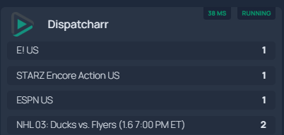

# Dispatcharr Homepage Widget (Dynamic List)

Homepage widget for Dispatcharr with an auto-refreshing status proxy.

This setup uses a small proxy to fetch Dispatcharr status and auto-refresh the
JWT token. Homepage then reads the proxy endpoint and renders all active
streams as a dynamic list.

## Screenshot



## Files

- `dispatcharr-proxy.py`: Minimal HTTP proxy with token refresh.
- `docker-compose.yml`: Example container for the proxy.
- `services.yaml`: Homepage widget snippet.

## Usage

1) Set your Dispatcharr URL (typically an internal IP) and credentials in the
   compose file.
2) Run the proxy container.
3) Add the `services.yaml` widget block to your Homepage config.

## Quick Start

1) Edit `docker-compose.yml` and set `DISPATCHARR_BASE_URL`, username, and
   password.
2) Start the proxy:

```bash
docker compose up -d
```

3) Confirm the proxy responds:

```bash
curl http://localhost:8080/status
```

4) Copy the widget from `services.yaml` into your Homepage config and update
   `href` to your internal Dispatcharr URL.

## Troubleshooting

- `401` or `403` responses usually mean bad credentials or a mismatched token
  endpoint.
- Empty list: verify `DISPATCHARR_STATUS_PATH` matches your Dispatcharr API.
- Connection errors: make sure Homepage can reach `dispatcharr-proxy` on the
  same Docker network, or point the widget URL at the host IP/port.

## Environment Variables

- `DISPATCHARR_BASE_URL` (required)
- `DISPATCHARR_USERNAME` (required)
- `DISPATCHARR_PASSWORD` (required)
- `DISPATCHARR_STATUS_PATH` (optional)
- `DISPATCHARR_TOKEN_PATH` (optional)
- `DISPATCHARR_REFRESH_PATH` (optional)
- `DISPATCHARR_PROXY_HOST` (optional)
- `DISPATCHARR_PROXY_PORT` (optional)

## Notes

- The proxy listens on `/status` and returns the upstream JSON as-is.
- For most home labs, use an internal IP for Dispatcharr instead of a public
  domain.
- Homepage should be on the same Docker network to reach `dispatcharr-proxy`.
- Use secrets or an `.env` file for credentials; do not hardcode them in git.
